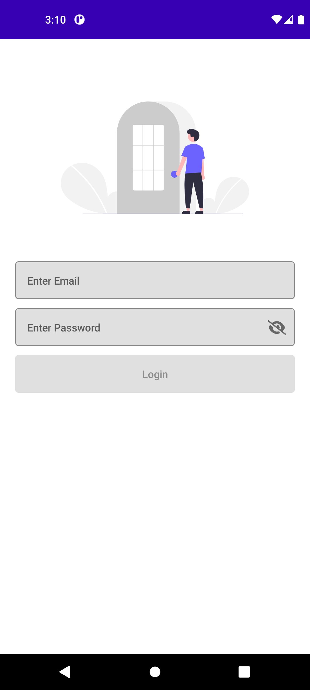
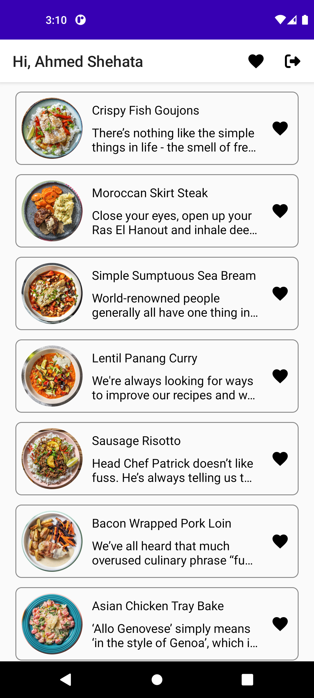
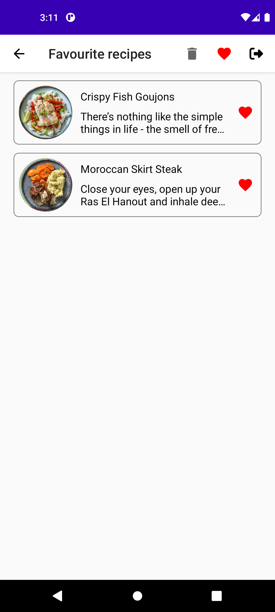
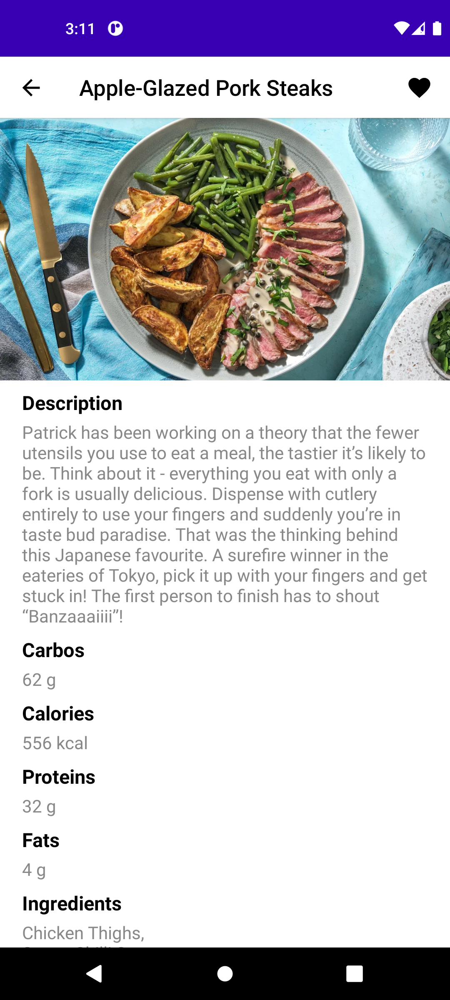
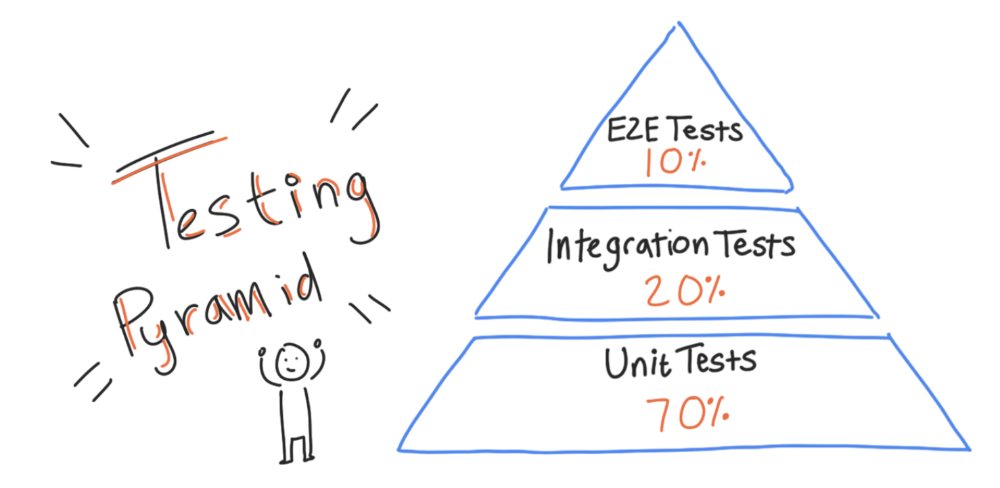

# Brightskies_task
You will have to build an app that displays a list of recipes. Each recipe from this list
should be clickable. When clicked, the recipe should open a details page with all
relevant information.

## ScreenShots:

  
  
  
  

## Demo

  

## APK Download
[Click here](https://drive.google.com/file/d/15yxJwuv35lZ2-g77FJnGheyvP9xcccKq/view?usp=sharing)

## In-App architecture

  

## In-App Testing

  

Unit testing for:
- Login module (data - repository - useCase)
- User module (data - repository - useCase)
- Recipes module (data - repository - useCase)
- 

UI test for:
- All app flow
- Login Screen
- Recipes Screen

## Features
- Dark and light mode
- Offline cashing
- Obfuscation
- Simple UI
- Animations
- Config changes handling

## Tools & APIs
- Jetpack Compose
- Compose navigation
- Clean architecture
- MVVM arch pattern (reactive MVI)
- Coroutines
- Channels & flows
- Retrofit
- Room
- Coil
- Unit testing
- UI testing
- Proguard

## Resources
- Testing
    - [Testing cheatsheet](https://developer.android.com/jetpack/compose/testing-cheatsheet)
    - [Testing your Compose layout](https://developer.android.com/jetpack/compose/testing#assertions)
    - [Write automated tests with UI Automator](https://developer.android.com/training/testing/other-components/ui-automator)
    - [Testing in Jetpack Compose - codelab](https://developer.android.com/codelabs/jetpack-compose-testing)
    - [Hilt testing guide](https://developer.android.com/training/dependency-injection/hilt-testing#groovy)

